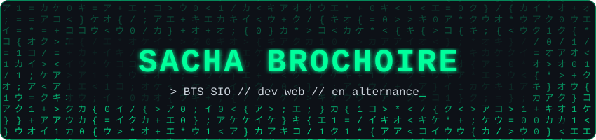
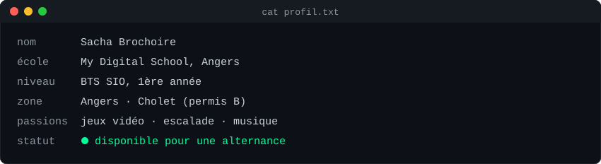
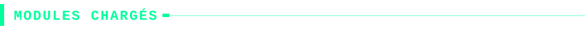
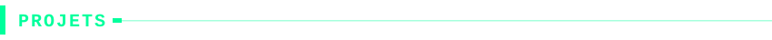
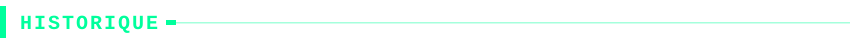
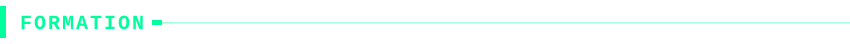
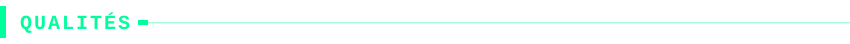
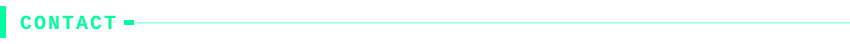

 

| Catégorie | Technos |
| --- | --- |
| 🌐 **Web** |    |
| 🐍 **Back & données** |   |
| 🔌 **Électronique** |    |
| 🎮 **Jeux** |  |
| 🛠️ **Éditeurs** |    |
| 🖥️ **Systèmes** | machines virtuelles, bases de réseau |

 

| Projet | C'est quoi | Stack |
| --- | --- | --- |
| 🌍 **Mon site perso** | Mon premier site, fait de A à Z | HTML · CSS · JS |
| 🎮 **Site de mon jeu préféré** | Un site rien que pour mon jeu vidéo favori | HTML · CSS · JS |
| 👥 **Projet NSI en groupe** | Site libre fait en équipe | HTML · CSS · JS · Python · SQL |
| 📚 **Travaux NSI** | Plusieurs sites web, et comprendre comment marchent un réseau et un ordinateur | Web · Réseau |

> 📌 Les liens vers mes dépôts arrivent ici : `[nom](https://github.com/TON-PSEUDO/nom-du-depot)`

 

| Date | Où | Poste | Ce que j'y ai fait |
| --- | --- | --- | --- |
| avr. 2026 | **CNP Assurances**, Angers | 💻 Technicien informatique | Machines virtuelles, observation des services info |
| juin 2024 | **JYGA**, Cholet | ⚙️ Opérateur machine à commande numérique | Construction de machines, modélisation, programmation |
| juin 2024 | **SEIA**, Champtocé-sur-Loire | 🔥 Soudeur | Fabrication et soudure de cartes électroniques |
| févr. 2023 | **Salec**, Le Lion-d'Angers | 🔌 Câbleur | Câblage d'armoire électronique |
| juil. 2022 | **25Lignes**, Les Herbiers | 🧑‍💻 Développeur full stack | Mon premier site en HTML / CSS / JS |
| avr. 2022 | **MG Teck**, Champtocé-sur-Loire | 🏠 Domoticien | Observation de la programmation de lignes de fabrication |

Les stages en atelier m'ont appris à souder une carte avant de la programmer. Ça aide.

 

| Années | Diplôme | Où |
| --- | --- | --- |
| 2026 - 2028 | 🎓 **BTS SIO** | My Digital School, Angers |
| 2026 | 📜 **Baccalauréat** (obtenu) | Lycée Saint-Aubin-La-Salle, Verrières-en-Anjou |

 

 

Une alternance ou un stage à proposer ? Un bug à m'expliquer ? Écris-moi.

<!-- Ajoute ton LinkedIn :  -->

<!-- Stats GitHub, à activer quand tu auras quelques dépôts (remplace TON-PSEUDO)

-->

